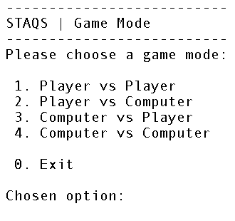
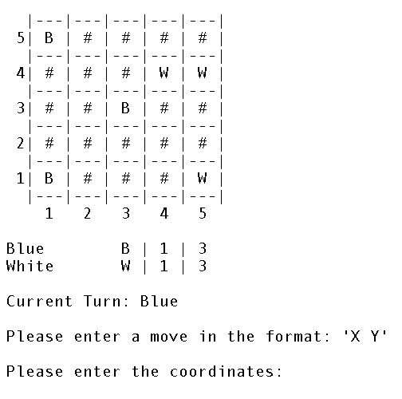
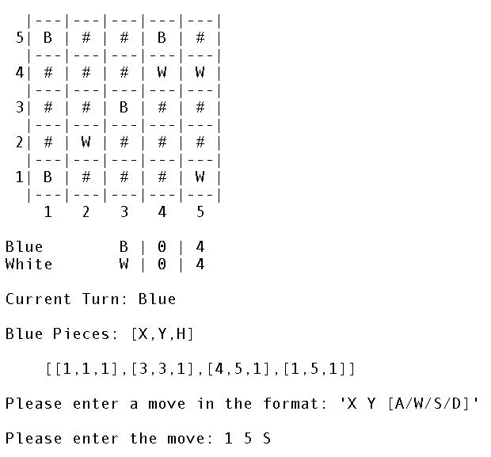
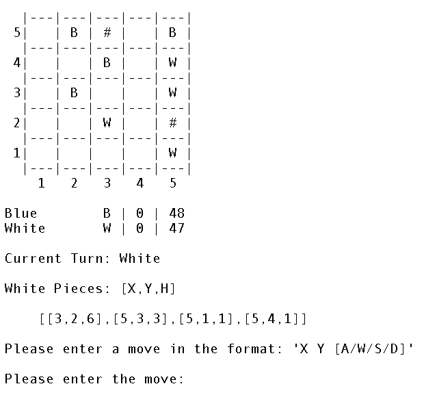
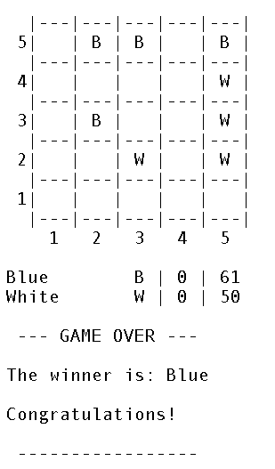

# PrologSTAQS

## Identification

**Topic:** *STAQS: A Strategic Two-Player Board Game* <br>
**Group:**
* **Name:** STAQS_5
* **Student:** Afonso Machado Neves, [up202108884@up.pt](mailto:up202108884@up.pt)

Project solely developed by Afonso Machado Neves, for the *Functional and Logic Programming* course unit, in the context of the Bachelor's in *Informatics and Computing Engineering* at *FEUP*.

## Installation and Execution

To play the game, follow these steps:

1. Install [*SICStus Prolog 4.9*](https://sicstus.sics.se/download4.html)
2. Download the ***src*** folder from the ZIP archive.
3. Open *SICStus Prolog* and consult the ***game.pl*** file.
4. Run the play\0 predicate:
   ```prolog
   ?- play.
   ```

## Game Description

**STAQS** is a strategic two-player board game played on a 5x5 grid. Players take turns moving their stacks one step at a time, aiming to create the tallest stack on the board. The game combines territory control and vertical stacking, challenging players to outmaneuver their opponent through clever positioning and stack building. The game ends when no more moves are possible, and victory goes to the player who controls the tallest stack.

### Components
* 25 neutral stackable pieces.
* 4 blue stackable pieces.
* 4 white stackable pieces.

### Setup
1. Arrange the 25 neutral pieces into a 5x5 grid.
2. Players select their color: blue or white.
3. Blue goes first, and players alternate turns to place one of their pieces on top of a neutral piece.

### Gameplay
1. Players take turns moving their stacks, one step at a time onto an adjacent neutral piece.
2. Movement must be orthogonal (up, down, left, or right). Stacks cannot jump over other stacks or move into empty spaces.
3. A player passes if they cannot make a valid move. If both players pass consecutively, the game ends.

### Winning Conditions
1. The player controlling the tallest stack wins.
2. If tied, the player with the most stacks of that height wins.
3. Further ties are resolved by comparing the next tallest stacks, continuing until a winner is found.

### References
- [BoardGameGeek STAQS Website](https://boardgamegeek.com/boardgame/425529/staqs)

## Considerations for Game Extensions

Since the game is relatively simple, there were several considerations for extending it to make it more challenging and engaging for players. Unfortunately, due to time and manpower constraints, these features were not implemented in the current version of the game. However, they could be considered for future development:

1. **Variable Board Sizes:** Allow players to choose different board sizes.

2. **Advanced AI:** Implement more sophisticated AI algorithms to provide a greater challenge for players.

3. **Time Limits:** Add time limits for each player's turn to increase the pace of the game and prevent players from taking too long to make a move.

4. **Blockades:** Introduce the concept of blockades, where players can block their opponent's movement by placing special pieces on the board.

## Game Logic

This section provides an overview of the game logic implemented in Prolog, including the game representation, internal state representation, move representation, and user interaction.

### Game Configuration Representation
To set up the game, the player must select the game mode, difficulty, and player names. The game configuration is represented as a list containing such information in the following format:
```prolog
[GameMode, Difficulty, BluePlayerName, WhitePlayerName]
```
This structure is used by the `initial_state/2` predicate to set up the initial game state, as well as the game loops to fetch the game difficulty.

### Internal Game State Representation
The most central aspect of the game logic is the internal game state representation, which includes the **board**, **current player**, **player information**, and **remaining pieces**. The `GameState` is represented as a list containing the following elements:
```prolog
[Board, CurrentPlayer, BluePlayer, WhitePlayer, RemainingBlue, RemainingWhite]
```
This structure contains the following elements:
- Board: A 5x5 grid represented as a list of lists, each containing the stack information for each cell. The pieces are represented as atoms, such as `empty`, or `neutral`, or a list of the player color and stack height, such as `[blue, 2]`.

- Current Player: The player whose turn it is to move. The player is represented as an atom, either `blue` or `white`.

- Blue/White Player: A list containing the player type and name for each player. The player type can be `human` or `computer`, and the name is a string.

- Remaining Blue/White: The number of remaining pieces for each player.

### Game State Transitions

The `GameState` is updated by applying moves to the board and changing the current player. During the game, the state transitions through the following steps:

- Initial: `[[neutral, neutral, ...], blue, [human, 'Blue'], [human, 'White'], 4, 4]`
- Placing: `[[[blue, 1], neutral, neutral, ...], white, [human, 'Blue'], [human, 'White'], 1, 2]`
- Moving: `[[empty, [blue, 2], neutral, ...], white, [human, 'Blue'], [human, 'White'], 0, 0]`
- Final: `[[empty, empty, empty, ...], blue, [human, 'Blue'], [human, 'White'], 0, 0]`

### Move Representation
Since the game is separated into the placing and moving phases, moves are represented differently depending on the phase. The `move/3` predicate is responsible for updating the game state based on the move provided by the player. The move representation is as follows:

- Placing: `[CordX, CordY]`
- Moving: `[CordX, CordY, Direction]`

Since the board has coordinates (1,1) in the bottom-left corner, the move\3 and other predicates must convert the CordY to 6 - CordY, so the coordinates are correctly represented when handling the matrix.

### User Interaction
Both the `GameMode Selector`, `Difficulty Selector`, and `PlayerName Selector` predicates are responsible for fetching the user input and setting up the game configuration using the `read_and_validate_int\2` and `read_and_validate_string\2` predicates. These predicates ensure that the user input is valid and within the expected range or format depending on the context.

Later on, the `read_and_validate_place\1` and `read_and_validate_move\1` predicates are responsible for fetching the user input during the placing and moving phases, respectively. These predicates ensure that the user input is valid and within the expected range and also validate the move based on the current game state.

## Conclusions

With this project, I was able to develop a fully functional two-player board game in Prolog, implementing the game logic, user interface, and greedy algorithm for the computer player.

### Limitations
- The game currently supports only a 5x5 board.
- Limited AI capabilities for computer players.

### Issues
- Currently, the game has a bug where the computer player may "eat" an opponent's stack, which is not allowed by the game rules. Unfortunately, I was unable to identify the source of this bug, since it only occurs in specific situations.

### Future Improvements
Since the group project was developed individually, additional features were unable to be implemented due to time and manpower constraints. As explained in the [*Considerations for Game Extensions*](#considerations-for-game-extensions) section, several features could be added to enhance the game experience and make it more challenging for players.

## Bibliography
- [PFL Lecture Slides](https://moodle2425.up.pt/course/view.php?id=4040)
- [SICStus Prolog Documentation](https://sicstus.sics.se/documentation.html)
- [Stack Overflow](https://stackoverflow.com/)
- [Grammarly](https://app.grammarly.com)
- [ChatGPT](https://chatgpt.com/) and [GitHub Copilot](https://github.com/features/copilot) were used for the following tasks:
    - Fix bugs in the *game.pl* file, most notably in the `move/3`, `valid_moves/3`, and `game_over/1` predicates.
    - Fix grammatical errors and improve the overall quality of the README file.

## Annexes

In this section, you can find screenshots of the game interface during the different phases of the game.

### Main Menu
</img>
### Placing Phase
</img>
### Moving Phase
</img>
### Final Moments
</img>
### Game Over
</img>
